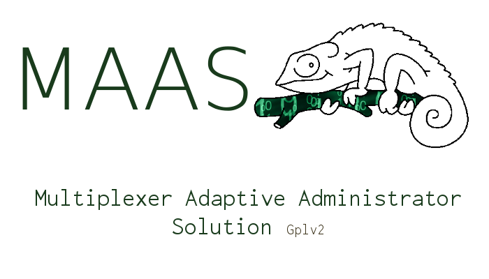

# MAS - Multiplexer Administrator Solution

GPLv2 or later - aurelien@hackers.camp - Aurelien DESBRIERES

## Mas is a toolkit that works on all your different type of OS remotely at the same time.

#### To use MAS you have to 'ENABLE ROOT LOGIN OVER SSH IN YOUR CLUSTER'
REDHAT Documentation -> https://access.redhat.com/documentation/en-US/Red_Hat_Enterprise_Linux/6/html/V2V_Guide/Preperation_Before_the_P2V_Migration-Enable_Root_Login_over_SSH.html

### It is made to works on:

	- Archlinux / Parabola and derivative
	- RedHat / Fedora / Freedora and derivative
	- Debian / Ubuntu / Trisquel and derivative
	- Android / Cyanogen / Replicant and (rooted) derivative

### How use it:

	- . configure
	- It will load installation of dependencies

 
### What it does:

	- Update and Upgrade a cluster of different type of OS from one command
	- Install a package from the package manger of the OS
	- Load directly a command all over your hostfile

### Can works with plugin

	- FARON - Forensic Analyser Remote Over Network
	  . FARON offer the tools of FAST with the power of MAS
	  . Log everything and bring them back to the admin
	- VirusScan - Scan, log and bring back log to the admin
	  . Load an up to date version of antivirus
	  . Log and bring back the log to the admin

	

